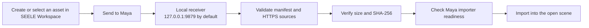

<h1 align="center">Seele-art-maya</h1>

<p align="center"><strong>A secure localhost receiver and Autodesk Maya import bridge for validated 3D asset transfers from SEELE Workspace.</strong></p>

<p align="center">
  <a href="https://www.autodesk.com/products/maya/overview"></a>
  <a href="#production-download"></a>
  <a href="#compatibility"></a>
</p>

<p align="center">
  <a href="https://www.seeles.ai/features/tools/ai-3d-model-generator-entry">Create with SEELE AI 3D</a> &middot;
  <a href="#production-download">Download 0.2.0</a> &middot;
  <a href="#quick-start">Quick start</a> &middot;
  <a href="#development-and-validation">Development</a>
</p>

<p align="center">
  FBX, OBJ, and Alembic assets arrive through a local browser-to-Maya handoff at <code>127.0.0.1:9879</code> by default.
</p>

> **Receiver, not generator.** This repository contains the Maya-side transfer receiver and import bridge. The browser-based [SEELE AI 3D Model Generator](https://www.seeles.ai/features/tools/ai-3d-model-generator-entry) and SEELE Workspace are separate services.

## Why Seele-art-maya?

- **Continue in Maya.** Create or select an asset in SEELE Workspace, send it to an open Maya session, then inspect and edit it with Maya's own tools.
- **Keep the receiver local.** The service binds to the loopback host `127.0.0.1` and uses port `9879` by default; it does not listen on a LAN or public interface.
- **Validate before import.** The receiver checks the `dcc-transfer.v1` manifest, target receiver, expiry, paths, allowed HTTPS hosts, declared sizes, and SHA-256 digests before import.
- **Respect Maya runtime capability.** FBX, OBJ, and Alembic are offered only when the running Maya environment reports the required translator, plug-in, or command as ready.
- **Limit incomplete scene changes.** Imports run on Maya's main thread, and failed or cancelled work is rolled back when possible.

## Production download

**[Download SEELE Maya Transfer 0.2.0](https://static.seeles.ai/kokokeepall/Plugin/Maya/SEELE-Maya-Transfer-0.2.0.zip)**

The URL above is the currently published production package. Maya modules must be installed as extracted files—do not point Maya at the ZIP directly.

| Release property | Value |
| --- | --- |
| Version | `0.2.0` |
| Archive | `SEELE-Maya-Transfer-0.2.0.zip` |
| File size | `26,793 bytes` |
| SHA-256 | `d13cea96e9cb58597a127141127d9c14a854e61b12be8f933338e7cb67123415` |
| Audited source commit | `b7b59a41d34fe1296b1a2cacee70a0d1eb948fe9` |

Verify the downloaded archive before installation:

```powershell
Get-FileHash .\SEELE-Maya-Transfer-0.2.0.zip -Algorithm SHA256
```

```bash
shasum -a 256 SEELE-Maya-Transfer-0.2.0.zip
```

## Requirements

- Autodesk Maya **2022 or newer**.
- Windows or macOS with a personal Maya modules directory.
- Access to [seeles.ai](https://www.seeles.ai) and an internet connection while transferred files are downloaded.
- Permission for Maya to bind the loopback receiver at `127.0.0.1:9879` by default.
- The extracted official `0.2.0` package from the production link above.

## Install

1. Download and extract `SEELE-Maya-Transfer-0.2.0.zip`.
2. Keep `SeeleMaya.mod` and the `SeeleMaya/` folder as siblings. Do not rename either item.
3. Copy both items into your personal Maya modules directory:

   | Platform | Typical personal modules directory |
   | --- | --- |
   | Windows | `%USERPROFILE%\Documents\maya\modules\` |
   | macOS | `~/Library/Preferences/Autodesk/maya/modules/` |

   Create the `modules` directory if it does not exist.
4. Restart Maya so it discovers `SeeleMaya.mod`.
5. Open **Windows → Settings/Preferences → Plug-in Manager**, find `seele_maya_plugin.py`, load it, and optionally enable **Auto load**.

### Upgrade

Quit Maya completely, replace the installed sibling pair (`SeeleMaya.mod` and `SeeleMaya/`) with the pair from the new archive, then restart Maya and confirm that `seele_maya_plugin.py` loads.

### Uninstall

Quit Maya, then remove `SeeleMaya.mod` and its sibling `SeeleMaya/` folder from the modules directory. Per-user receiver and transfer data is stored separately under the local SEELE application-data directory and is not automatically removed with the module.

## Quick start

1. Start Maya and load `seele_maya_plugin.py`.
2. Keep Maya open. The plug-in starts its local receiver at `127.0.0.1:9879` unless `SEELE_MAYA_PORT` overrides the default port.
3. In SEELE Workspace, choose a ready 3D asset and use the Maya transfer action.
4. The browser obtains a short-lived receiver challenge and sends a `dcc-transfer.v1` transfer manifest.
5. The plug-in validates the request, downloads and verifies the declared files, checks importer readiness, and imports the asset.
6. Inspect geometry, hierarchy, scale, materials, and textures before using the result in production.



## Compatibility

| Format or environment | Status in 0.2.0 | Runtime boundary |
| --- | --- | --- |
| Autodesk Maya | Maya 2022+ | Install as an extracted Maya module on Windows or macOS. |
| FBX (`.fbx`) | Capability-driven | Requires the `fbxmaya` plug-in and the `FBX` translator to be ready. Optional declared textures may include PNG, JPG/JPEG, TGA, TIF/TIFF, EXR, or BMP. |
| OBJ (`.obj`) | Capability-driven | Requires the Maya `OBJ` translator. Declared MTL and texture dependencies are validated; a referenced MTL that was not provided can finish with `OBJ_MTL_NOT_PROVIDED`. |
| Alembic (`.abc`) | Capability-driven | Requires the `AbcImport` plug-in and command to be ready. External dependencies are not accepted for this format. |
| DAE / COLLADA (`.dae`) | Not advertised ready | Registry entry exists, but its import surface is not verified for this release. |
| USD / USDA / USDC | Disabled | Registry entries exist, but no verified import handler is enabled in `0.2.0`, including when `mayaUsdPlugin` is installed. |
| GLB, glTF, USDZ, STL, MA, MB, 3DS, ASS | Not supported | These formats are explicitly outside the accepted Maya transfer set in this release. |

A readiness result proves that the required import surface is available in the current Maya process. It does **not** prove that every asset variant has been validated on every Maya and operating-system combination.

## Security and privacy boundary

- **Loopback host:** the receiver host is fixed to `127.0.0.1`; `SEELE_MAYA_PORT` can change the default port but not expose the host on a public interface.
- **Exact browser origins:** production requests are accepted from the exact origin `https://www.seeles.ai` by default. Origin matching is not wildcard-based.
- **Receiver challenge:** transfer submission uses a short-lived, single-use challenge tied to the receiver and requesting origin.
- **HTTPS allowlist:** downloads require HTTPS on port 443 and an exact allowlisted host. Redirect targets are validated again; IP-literal hosts, credentials in URLs, fragments, unsafe DNS results, and lookalike subdomains are rejected.
- **Manifest limits:** requests, file counts, aggregate transfer size, path shape, manifest lifetime, and concurrent work are bounded.
- **Integrity checks:** each file requires a declared byte size and lowercase SHA-256 digest; both are verified before import.
- **Safe staging:** traversal, reserved paths, case/Unicode collisions, staging conflicts, and unsafe filesystem targets are rejected.
- **No shell import path:** downloads use HTTPS and imports use Maya's API/import surfaces; the receiver does not invoke a shell to process transferred assets.
- **Inbound workflow only:** the documented receiver accepts transfer manifests and downloads their declared assets. It is not a Maya scene-export or remote-control service.

Administrators can append controlled values with comma-separated `SEELE_ALLOWED_ORIGINS` and `SEELE_ALLOWED_DOWNLOAD_HOSTS`. Neither setting supports `*`; extending either allowlist expands the trust boundary and should be done deliberately.

## Troubleshooting

### Maya does not discover the module

Confirm that `SeeleMaya.mod` and `SeeleMaya/` are siblings directly inside a Maya `modules` directory—not inside the ZIP or an extra nested directory—then restart Maya.

### The plug-in does not load

Use Maya 2022 or newer. Load `seele_maya_plugin.py` in Plug-in Manager and inspect Maya's Script Editor for the specific error. Restart Maya after replacing an already loaded version.

### SEELE cannot connect to Maya

Keep Maya open and the plug-in loaded. Confirm that local security software is not blocking the configured loopback port, and retry from the exact production origin `https://www.seeles.ai`. If `SEELE_MAYA_PORT` is set, the browser integration must target that same port.

### A format is unavailable

The receiver fails closed when the required Maya import surface is unavailable. Check the relevant translator, plug-in, or command in that Maya session. DAE and USD-family imports remain intentionally unavailable in `0.2.0`.

### Download or verification fails

Confirm internet access and retry. The receiver deliberately rejects non-allowlisted URLs, unsafe redirects or DNS results, size mismatches, hash mismatches, and unsafe paths rather than falling back to an unchecked import.

### OBJ imports without expected materials

A referenced MTL that was not supplied can produce an `OBJ_MTL_NOT_PROVIDED` warning while geometry still imports. Inspect the result and transfer the required material and texture dependencies when fidelity matters.

## Development and validation

Pure-Python contract, format, HTTP, readiness, snapshot, transfer, and security tests run without Maya:

```bash
PYTHONDONTWRITEBYTECODE=1 python -m unittest discover -s tests -v
```

The GitHub Actions matrix runs these tests on Windows and macOS with Python 3.7 and 3.10. Maya runtime smoke coverage must use the `mayapy` executable for the exact Maya and OS combination being evaluated:

```powershell
& "C:\Program Files\Autodesk\Maya2022\bin\mayapy.exe" tests_maya\smoke.py
```

A smoke pass establishes evidence only for that exact runtime. Release validation should also cover representative FBX, OBJ, and ABC assets, dependency handling, cancellation and rollback, and path-safety behavior.

## Support

Report defects and integration feedback through [GitHub Issues](https://github.com/SeeleAI/Seele-art-maya/issues). Include the Maya version, operating system, plug-in revision, transfer result, and a redacted Script Editor excerpt. Do not include credentials or signed download URLs.

## License

This repository does not currently include a `LICENSE` file. Do not infer an open-source or redistribution license from the source repository or production archive; obtain the applicable terms from SEELE before redistribution or commercial use.
