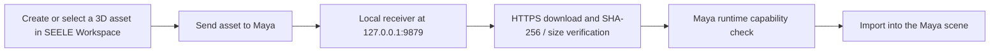

# SEELE Transfer for Maya


**[Download SEELE Transfer for Maya 0.2.0](https://static.seeles.ai/kokokeepall/Plugin/Maya/SEELE-Maya-Transfer-0.2.0.zip)**

SEELE Transfer for Maya is a Maya plugin/add-on that receives and imports 3D assets sent from SEELE Workspace. It is a secure localhost receiver and Maya import bridge—not an AI generator running inside Maya.

For browser-based generation, use [AI 3D Model Generator: Start Creating 3D Assets | SEELE AI](https://www.seeles.ai/features/tools/ai-3d-model-generator-entry). After an asset is available in SEELE Workspace, this plugin provides the Maya-side path to send 3D assets to Maya.

## What It Does

- Receives `dcc-transfer.v1` asset-transfer manifests from the production SEELE website.
- Downloads declared files over HTTPS, stages them safely, and checks the manifest-provided file size and SHA-256 digest before import.
- Imports FBX, OBJ, or Alembic (`.abc`) only when the current Maya runtime reports the required importer capability as ready.
- Runs Maya imports on Maya's main thread and rolls back incomplete imports when possible.
- Keeps its receiver local to the machine at `127.0.0.1:9879`.

This repository contains the Maya receiver/import bridge only. SEELE Workspace and the AI 3D model generator are separate services.

## Who It Is For

SEELE Transfer is for artists, technical artists, designers, and developers who create or select an asset in SEELE Workspace and want to continue working on it in Autodesk Maya. It is intended for a handoff workflow: create an asset on SEELE, send it to an open Maya session, inspect the imported scene, then continue using Maya's own tools.

## Requirements

- Autodesk Maya **2022 or newer**.
- Access to [seeles.ai](https://www.seeles.ai) and an internet connection while transferred assets are downloading.
- Permission for Maya to bind the local loopback port `127.0.0.1:9879`.
- The official 0.2.0 package, downloaded from the link above.

## Install on Windows or macOS

Maya modules must be installed as extracted files. **Do not point Maya at the ZIP directly.**

1. Download and extract `SEELE-Maya-Transfer-0.2.0.zip`.
2. Keep `SeeleMaya.mod` and the `SeeleMaya/` folder as siblings in the same directory. Do not rename either item.
3. Copy both items into your personal Maya modules directory:

   | Platform | Typical personal modules directory |
   | --- | --- |
   | Windows | `%USERPROFILE%\Documents\maya\modules\` |
   | macOS | `~/Library/Preferences/Autodesk/maya/modules/` |

   Create the `modules` directory if it does not exist.
4. Restart Maya so it discovers `SeeleMaya.mod`.
5. Open **Windows > Settings/Preferences > Plug-in Manager**, find `seele_maya_plugin.py`, load it, and enable **Auto load** if you want the receiver to start with Maya.

### Upgrade

1. Quit Maya completely.
2. Replace the existing sibling pair—`SeeleMaya.mod` and `SeeleMaya/`—with the extracted pair from the new package.
3. Restart Maya and confirm that `seele_maya_plugin.py` loads in Plug-in Manager.

### Uninstall

Quit Maya, then remove the installed `SeeleMaya.mod` file and its sibling `SeeleMaya/` folder from the Maya modules directory. The plugin's per-user transfer data is stored separately under the local SEELE application-data directory; removing the module does not automatically remove that data.

## Quick Start

1. Start Maya and load `seele_maya_plugin.py`.
2. Confirm the local receiver is running; its fixed address is `127.0.0.1:9879`.
3. In SEELE Workspace, choose an asset and use the Maya transfer action.
4. SEELE sends a short-lived manifest to Maya. The receiver downloads, verifies, and imports the declared asset when its format is available in that Maya runtime.
5. Inspect the imported scene, including geometry, materials, textures, scale, and hierarchy, before continuing production work.

## Workflow



## Compatibility

| Format or environment | Status in 0.2.0 | Notes |
| --- | --- | --- |
| Autodesk Maya | Maya 2022+ | Requires the extracted module installation. |
| FBX | Capability-driven | Available only when the running Maya runtime reports the FBX importer ready. |
| OBJ | Capability-driven | Available only when the running Maya runtime reports the OBJ translator ready. Missing referenced MTL files can complete with an `OBJ_MTL_NOT_PROVIDED` warning; other declared-file validation failures are fatal. |
| Alembic (`.abc`) | Capability-driven | Available only when the running Maya runtime reports `AbcImport` ready. |
| DAE / COLLADA | Not advertised ready | The importer surface has not been product-validated for this release. |
| USD, USDA, USDC | Disabled | No import handler is enabled in 0.2.0, including where `mayaUsdPlugin` is installed. |

The plugin can report runtime readiness for FBX, OBJ, and Alembic import. That is not a claim that every asset variant has been validated on every Maya/OS combination; evaluate imports in your target Maya environment.

## Security, Privacy, and Network Behavior

- **Local receiver only:** the HTTP receiver binds to `127.0.0.1:9879`, not a public network interface.
- **Production origin:** browser requests are accepted only from the exact origin `https://www.seeles.ai` by default. Wildcard origins are not supported.
- **Allowed downloads:** transferred files must use HTTPS and an exact allowlisted SEELE download host. Redirects are checked again; lookalike subdomains, unsafe DNS results, and non-HTTPS URLs are rejected.
- **Integrity checks:** declared content length is checked before download and each downloaded file is checked against its declared size and SHA-256 digest before import.
- **Safe staging:** paths and collisions are validated before files are committed to the local staging area.
- **No shell execution:** the receiver does not invoke a shell to process transfers; imports use the available Maya API/import surface.

Optional `SEELE_ALLOWED_ORIGINS` and `SEELE_ALLOWED_DOWNLOAD_HOSTS` environment values append trusted, comma-separated entries for controlled deployments. They do not support `*`; administrators should add only hosts they trust.

## Official Package Integrity

The production package currently published at the download link above has the following release metadata:

| Property | Value |
| --- | --- |
| Version | `0.2.0` |
| File size | `26,793 bytes` |
| SHA-256 | `d13cea96e9cb58597a127141127d9c14a854e61b12be8f933338e7cb67123415` |
| Audited source commit | `b7b59a41d34fe1296b1a2cacee70a0d1eb948fe9` |

To independently check a downloaded archive:

```powershell
Get-FileHash .\SEELE-Maya-Transfer-0.2.0.zip -Algorithm SHA256
```

```bash
shasum -a 256 SEELE-Maya-Transfer-0.2.0.zip
```

## FAQ

### Is SEELE Transfer for Maya an AI 3D model generator?

No. SEELE Transfer for Maya is a Maya plugin/add-on that receives, verifies, and imports 3D assets from SEELE Workspace. Use the [AI 3D Model Generator: Start Creating 3D Assets | SEELE AI](https://www.seeles.ai/features/tools/ai-3d-model-generator-entry) to generate assets in the browser.

### Can I send 3D assets to Maya directly from SEELE?

Yes, when Maya is open, `seele_maya_plugin.py` is loaded, and the local receiver is ready. SEELE Workspace sends a transfer manifest to the receiver at `127.0.0.1:9879`; the plugin then downloads and imports the asset if the required Maya importer is available.

### Which import formats does the Maya plugin support?

FBX, OBJ, and Alembic import are capability-driven: the plugin only reports them ready when that exact Maya runtime exposes the necessary importer. DAE is not advertised ready, and USD/USD variants are disabled in version 0.2.0.

### Does the plugin send my Maya scene to SEELE?

The receiver's documented role is to accept an incoming transfer manifest and download the asset files it declares from allowlisted HTTPS hosts. It is not a scene-export or remote-control plugin.

### Why is an OBJ imported without its materials?

An OBJ transfer without a provided referenced MTL file may import geometry and report `OBJ_MTL_NOT_PROVIDED`. Inspect the result and supply the asset's required material files when fidelity matters.

### Is this a public-network server?

No. The receiver is fixed to the loopback address `127.0.0.1:9879`, so it is intended to accept requests from the local machine rather than listen on the LAN or internet.

## Troubleshooting

### Maya does not discover the module

Verify that `SeeleMaya.mod` and `SeeleMaya/` are siblings inside a Maya `modules` directory, not inside the ZIP or an extra nested folder. Restart Maya after correcting the location.

### The plug-in will not load

Use Maya 2022 or newer. In Plug-in Manager, load `seele_maya_plugin.py` and review Maya's Script Editor for the specific load error. A full Maya restart after an upgrade clears a previously loaded module version.

### SEELE cannot connect to Maya

Keep Maya open and the plugin loaded. Confirm that local security software is not blocking localhost port `9879`, then retry from the exact production origin `https://www.seeles.ai`.

### A format is reported unavailable

The plugin fails closed when an importer is unavailable. Check that the required Maya importer is installed and available in that Maya session. DAE is not ready for this public release, and USD/USD variants are intentionally disabled.

### Download or verification fails

Confirm internet access and retry the transfer. The receiver rejects URLs outside its HTTPS allowlist and rejects declared files when their size or SHA-256 digest does not match; these checks are deliberate safeguards, not import fallbacks.

## Development and Tests

The repository includes pure-Python contract, security, readiness, HTTP, and format tests that can run without Maya:

```bash
PYTHONDONTWRITEBYTECODE=1 python -m unittest discover -s tests -v
```

For Maya runtime smoke coverage, run the smoke test through the `mayapy` executable for each supported Maya/OS build. A smoke pass establishes evidence for that exact environment only; release validation should additionally cover golden FBX/OBJ/ABC imports, cancellation/rollback, and path-safety behavior.

```powershell
& "C:\Program Files\Autodesk\Maya2022\bin\mayapy.exe" tests_maya\smoke.py
```

## License

This repository currently does not include a `LICENSE` file. Do not infer an open-source or redistribution license from the repository or package; obtain the applicable terms from SEELE before redistribution or commercial use.
